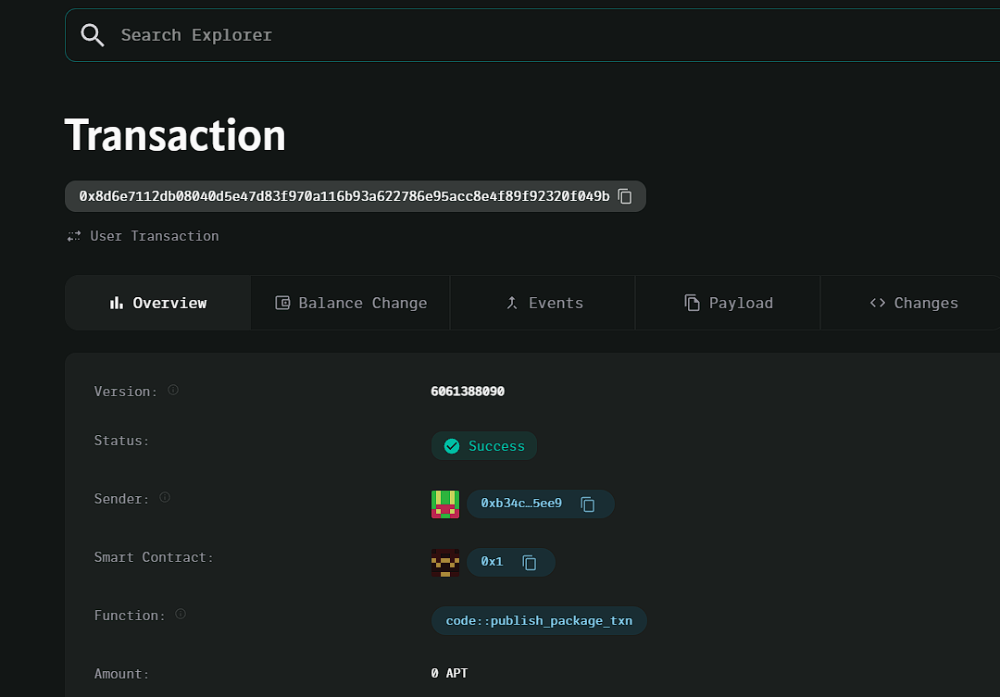

### Deployed smartcontract address: 0x8d6e7112db08040d5e47d83f970a116b93a622786e95acc8e4f89f92320f049b

### Screenshot: 

# Decentralized Fitness Tracker

## Project Title
Decentralized Fitness Tracker

## Project Description
The Decentralized Fitness Tracker is a blockchain-based platform that allows users to track their fitness progress and earn rewards in the form of tokens. Users can log their workout achievements, and based on these achievements, they receive token incentives to stay motivated. The platform ensures transparency, security, and immutable records of fitness goals and rewards.

## Vision
Our vision is to create a decentralized platform where users are rewarded for their fitness efforts. By leveraging blockchain technology, we aim to promote healthy lifestyles while ensuring that user data is securely stored and rewards are distributed fairly and transparently.

## Key Features
- **Workout Logging:** Users can log their workouts and track their fitness progress.
- **Token Rewards:** Earn tokens based on workout achievements, motivating users to stay active.
- **Immutable Records:** All fitness data and token rewards are stored on the blockchain, ensuring security and transparency.
- **Decentralization:** Users maintain control of their fitness data, with no central authority owning the platform.

## Future Scope
- **Social Features:** Introduce leaderboards and fitness challenges where users can compete with friends.
- **Token Marketplace:** Allow users to trade or exchange their fitness tokens for real-world rewards.
- **Smart Device Integration:** Integrate with wearable fitness devices to automatically track and log workouts.
- **Custom Goals:** Allow users to set personalized fitness goals and receive more specific rewards.
- **Mobile Application:** Develop a mobile-friendly dApp interface for seamless user interaction.
